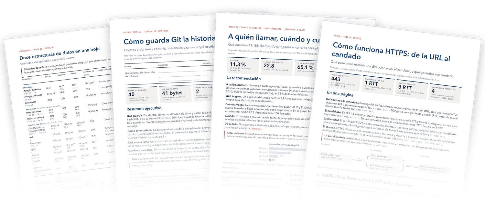
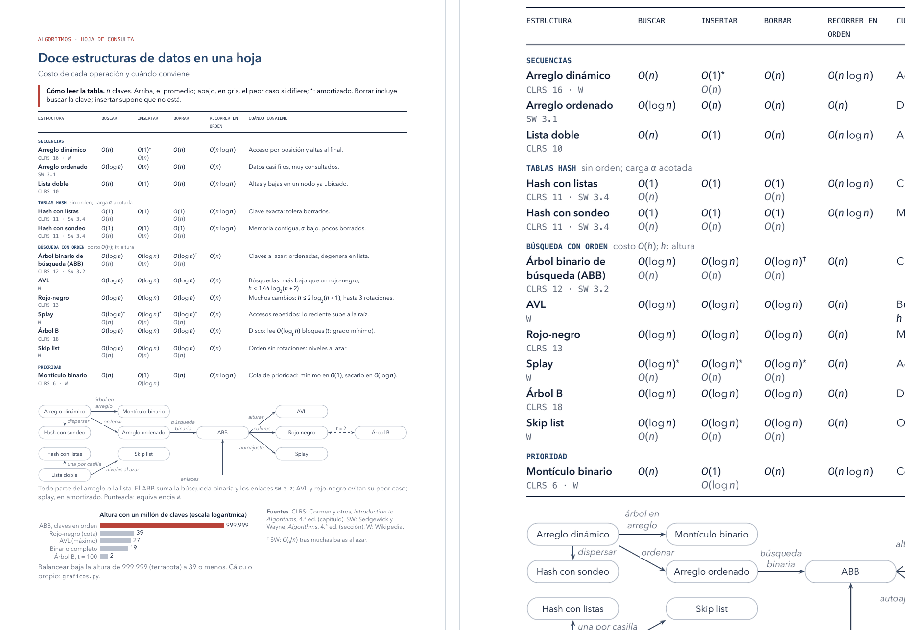
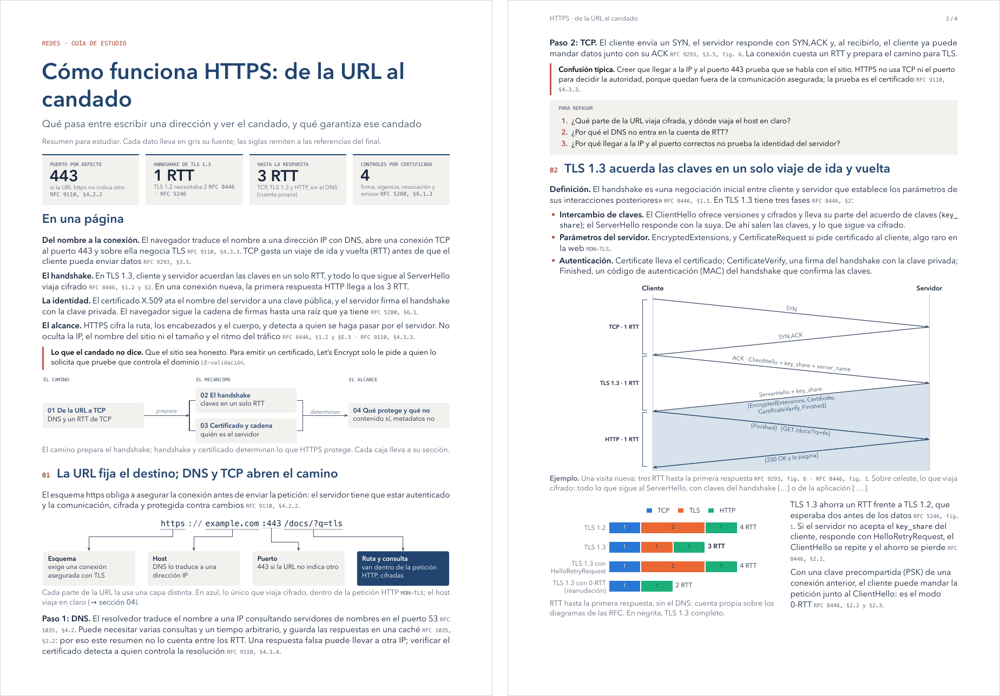
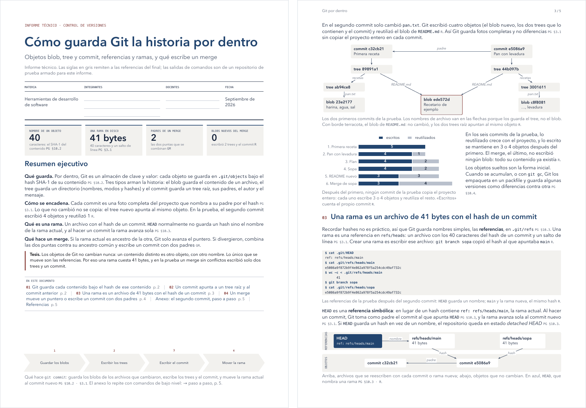
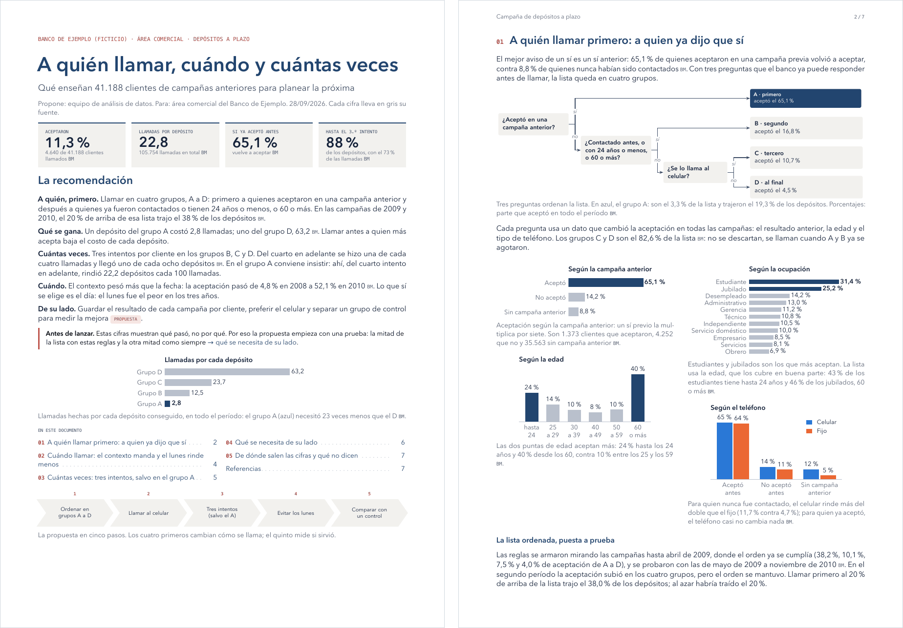
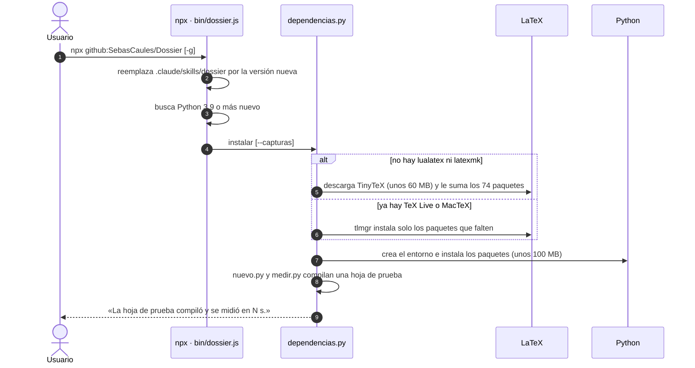
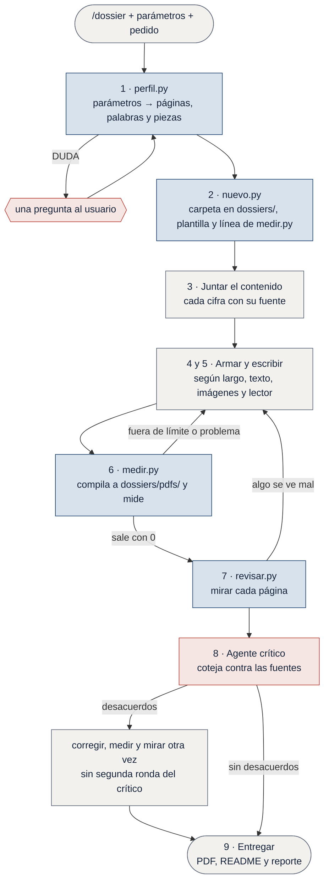
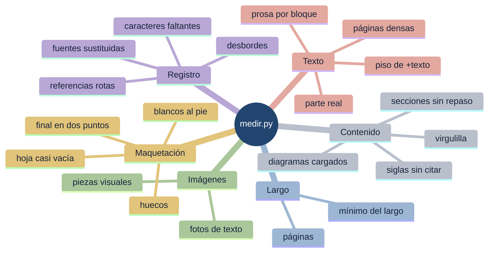
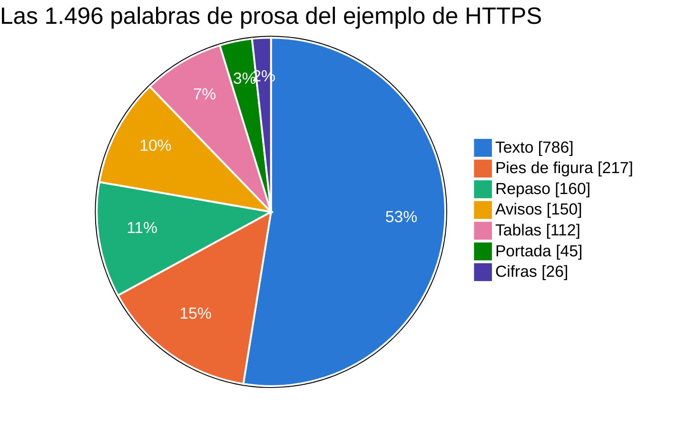
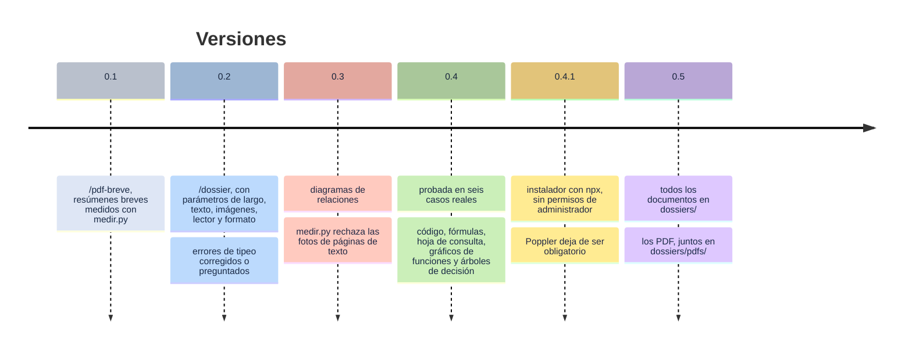

<!--
  Para mantener este README:
  - Las capturas y la portada se rehacen con `python3 ejemplos/capturas/generar.py`, desde la raíz.
  - Las cifras de «Cuánto mide» salen de dossier/scripts/perfil.py (tablas LARGOS y TEXTO):
    si cambian ahí, cambian aquí.
-->
<a name="readme-top"></a>

<div align="center">

<picture>
  <source media="(prefers-color-scheme: dark)" srcset="https://raw.githubusercontent.com/SebasCaules/Dossier/main/ejemplos/capturas/portada-oscura.webp">
  <source media="(prefers-color-scheme: light)" srcset="https://raw.githubusercontent.com/SebasCaules/Dossier/main/ejemplos/capturas/portada-clara.webp">
  
</picture>

# /dossier

**PDFs de lectura a medida para [Claude Code][claude-code]:** resúmenes para estudiar, informes
para entregar, documentos para un equipo o un cliente y hojas de consulta, del largo y con el
texto y las imágenes que se pidan. Antes de entregar, mide cada compilación y mira cada página.

[](package.json)
[][claude-code]
[](#instalar)
[](#instalar)
[](#instalar)
[](#instalar)

[Ejemplos](#ejemplos) · [Instalar](#instalar) · [Usar](#usar) · [Cuánto mide](#cuánto-mide) ·
[Cómo trabaja](#cómo-trabaja) · [Componentes](#componentes) · [Preguntas](#preguntas-frecuentes)

</div>

<table>
<tr>
<td width="33%" valign="top">

:straight_ruler: **El largo es un número**

`perfil.py` traduce el pedido a páginas, palabras y piezas visuales antes de escribir, y
`medir.py` lo controla en cada compilación.

</td>
<td width="33%" valign="top">

:eyes: **Mira cada página**

`revisar.py` dibuja el PDF página por página: los cortes, las etiquetas superpuestas y
los diagramas que desbordan solo existen ahí.

</td>
<td width="33%" valign="top">

:link: **Cada cifra con su fuente**

Las definiciones se copian de la fuente, cada número lleva `\fuente{…}` y un agente crítico
coteja todo antes de entregar.

</td>
</tr>
<tr>
<td width="33%" valign="top">

:bar_chart: **Gráficos con la letra del PDF**

`estilo_graficos.py` dibuja con la misma letra, el mismo tamaño y la misma paleta que el
documento.

</td>
<td width="33%" valign="top">

:compass: **Navegación con clics**

Índice cliqueable, marcadores, referencias cruzadas y un encabezado que vuelve al índice; en
papel, las páginas y las direcciones al pie.

</td>
<td width="33%" valign="top">

:package: **Un comando instala todo**

La skill, LaTeX si falta, un entorno de Python y una hoja de prueba, sin permisos de
administrador.

</td>
</tr>
</table>

## Ejemplos

Hechos con la skill, sobre temas y fuentes públicas. La imagen abre el PDF; el título, la
carpeta con el `.tex`, el código de los gráficos y un README con el pedido y las fuentes.

<table>
<tr>
<td width="50%" valign="top">

<a href="ejemplos/hoja-estructuras-de-datos/hoja-estructuras-de-datos.pdf"></a>

**[Doce estructuras de datos en una hoja](ejemplos/hoja-estructuras-de-datos/)**<br>
<sub><code>/dossier 1 hoja impresion -texto items=12</code> · 1 página</sub>

Hoja de consulta para imprimir: el costo de cada operación en doce estructuras, cuándo
conviene cada una, un mapa de cómo se relacionan y un gráfico. A la derecha, un detalle.

</td>
<td width="50%" valign="top">

<a href="ejemplos/breve-https/breve-https.pdf"></a>

**[Cómo funciona HTTPS: de la URL al candado](ejemplos/breve-https/)**<br>
<sub><code>/dossier breve lector=estudio</code> · 4 páginas</sub>

Guía de estudio con mapa del tema cliqueable; por concepto, definición, ejemplo y confusión
típica; repaso al cierre de cada sección, cinco diagramas y un gráfico.

</td>
</tr>
<tr>
<td width="50%" valign="top">

<a href="ejemplos/breve-git-por-dentro/breve-git-por-dentro.pdf"></a>

**[Cómo guarda Git la historia por dentro](ejemplos/breve-git-por-dentro/)**<br>
<sub><code>/dossier breve lector=entrega impresion</code> · 5 páginas</sub>

Informe para entregar: portada formal con renglones para completar, resumen ejecutivo,
sesiones de terminal con su salida, cinco diagramas, un gráfico y referencias.

</td>
<td width="50%" valign="top">

<a href="ejemplos/medio-campana-depositos/medio-campana-depositos.pdf"></a>

**[A quién llamar, cuándo y cuántas veces](ejemplos/medio-campana-depositos/)**<br>
<sub><code>/dossier medio lector=cliente +imagenes</code> · 7 páginas</sub>

Informe para el área comercial de un banco ficticio: la recomendación primero, una sección
por decisión y 14 gráficos hechos con el dataset público [*Bank Marketing*][bank-marketing] de UCI.

</td>
</tr>
</table>

<div align="right"><sub><a href="#readme-top">↑ volver arriba</a></sub></div>

## Instalar

> [!IMPORTANT]
> Hace falta **Node.js 18** y **Python 3.9**, o más nuevos, en macOS o Linux. En Windows, dentro
> de [WSL][wsl].

Un comando instala la skill y todo lo que necesita, sin permisos de administrador, y al final
compila una hoja de prueba. Para el proyecto actual (queda en `.claude/skills/dossier`, en la
raíz del repositorio git o en la carpeta actual si no hay repositorio):

```bash
npx github:SebasCaules/Dossier
```

Para todos los proyectos (queda en `~/.claude/skills/dossier`):

```bash
npx github:SebasCaules/Dossier -g
```

La primera vez descarga unos 150 MB y tarda de uno a cinco minutos, según la conexión; con
LaTeX ya instalado, mucho menos.

| Opción | Qué hace |
|:--|:--|
| `-g`, `--global` | instala para todos los proyectos, en `~/.claude/skills/dossier`[^config] |
| `--capturas` | suma Playwright y Chromium, para capturar pantallas y páginas web |
| `--solo-skill` | copia la skill y no instala nada más |
| `--verificar` | solo dice qué hay y qué falta; sale con 1 si falta algo |
| `--desinstalar` | quita la skill; LaTeX y el entorno de Python quedan |
| `-h`, `--help` | muestra la ayuda |

<details>
<summary><b>Qué instala y dónde</b></summary>
<br>

La skill se copia siempre; lo demás, solo si falta:

| Qué | Dónde | Ocupa | Cuándo |
|:--|:--|--:|:--|
| La skill | `.claude/skills/dossier` o, con `-g`, `~/.claude/skills/dossier` | 0,3 MB | siempre |
| [TinyTeX][tinytex], una versión pequeña de TeX Live, con los 74 paquetes y las letras que usa la skill | `~/Library/TinyTeX` (macOS) o `~/.TinyTeX` (Linux) | unos 350 MB | si no hay `lualatex` ni `latexmk` |
| Los paquetes de LaTeX que le falten a la distribución instalada | TeX Live o MacTeX, con su `tlmgr` | — | si ya hay LaTeX |
| Un entorno de Python con matplotlib, numpy, Pillow, pypdf, pdfplumber y pypdfium2 | `~/.local/share/dossier/venv`[^xdg] | unos 200 MB | si no está |
| Playwright y Chromium | el mismo entorno | — | con `--capturas` |

Los scripts de la skill pasan solos al Python de ese entorno y encuentran TeX aunque no esté en
el `PATH`. Poppler no hace falta: si está, se usa; si no, las páginas se leen con pypdfium2.
Si la distribución de LaTeX es del sistema y no se puede escribir en ella, el instalador no la
toca: muestra el comando de `tlmgr` para correr con `sudo`.

</details>

<details>
<summary><b>Qué hace el comando, paso a paso</b></summary>
<br>



</details>

> [!CAUTION]
> Instalar o actualizar **reemplaza la carpeta de la skill entera**: lo que se haya editado a
> mano dentro de `.claude/skills/dossier` se pierde. Los documentos ya hechos no se tocan, porque
> cada uno lleva su propia copia de `dossier.sty` y de `estilo_graficos.py`.

> [!TIP]
> Con [`npx skills`][skills-cli] también se instala, pero solo la skill:
> `npx skills add SebasCaules/Dossier -a claude-code` (con `-g`, global). Lo demás lo instala la
> skill la primera vez que se usa, después de pedir permiso.

**Actualizar:** el mismo comando. Reemplaza la skill por la última versión y no vuelve a
descargar lo que ya está.

**Desinstalar:** `npx github:SebasCaules/Dossier --desinstalar` (con `-g`, la global). Quita
solo la skill; el entorno de Python y TinyTeX quedan en las carpetas de la tabla de arriba.

<div align="right"><sub><a href="#readme-top">↑ volver arriba</a></sub></div>

## Usar

En Claude Code, escribir `/dossier`, los parámetros y el pedido, y <kbd>Enter</kbd>:

```text
/dossier breve lector=estudio un resumen de la unidad 3 con los apuntes de esta carpeta
/dossier 1 hoja impresion lo esencial del informe.pdf para llevar a la reunión
/dossier medio +imagenes lector=cliente un informe de ventas.csv para el directorio
```

Cada documento queda en `dossiers/<nombre>/`, en la raíz del proyecto, y su PDF en
`dossiers/pdfs/`, junto a los de los demás ([detalle](#cada-documento-en-su-carpeta)).

> [!NOTE]
> También se activa sola cuando se pide un PDF para leer o compartir («quiero un PDF con lo que
> hicimos», «una hoja con lo esencial»), aunque no se nombre la skill. No es para manipular PDFs
> que ya existen (unir, dividir, extraer texto, formularios) ni para armar diapositivas.

### Parámetros

Todos son opcionales, van en cualquier orden y mezclados con el tema. Al escribir
<kbd>/</kbd> y las primeras letras de `dossier`, el menú de comandos muestra la línea de
parámetros.

| Parámetro | Valores | Por defecto | Qué cambia |
|:--|:--|:-:|:--|
| **Largo** | `hoja` (o `1 hoja`) · `breve` · `medio` · `largo` | `breve` | 1 página · 2 a 6 · 7 a 12 · 13 a 24; el índice y la estructura |
| **Texto** | `-texto` · normal · `+texto` | normal | la prosa ocupa hasta el 25 %, el 40 % o el 60 % de las páginas; cuánto se desarrolla cada idea |
| **Imágenes** | `-imagenes` · normal · `+imagenes` | normal | alrededor de una pieza visual cada 2 páginas, una por página o 1,5 por página |
| **Lector** | `estudio` · `entrega` · `equipo` · `cliente` | según el pedido | las secciones que no pueden faltar ([ver abajo](#lectores)) |
| **Formato** | `digital` · `impresion` | `digital` | enlaces y marcadores para pantalla, o páginas y direcciones para papel |
| **Ajustes** | `temas=`<var>N</var> · `items=`<var>N</var> · `paginas=`<var>N</var> | — | calcula las páginas según las secciones o las unidades que hay que cubrir una por una, o las fija |

> [!TIP]
> Los parámetros también valen dichos en palabras: «un dossier mediano con más imágenes» es
> `medio +imagenes`. No importan las mayúsculas ni los acentos (`IMPRESIÓN`, `Imágenes`).

Un error de tipeo se corrige si hay un solo parámetro parecido, y la skill lo dice
(<samp>Interpreté «imprecion» como impresion.</samp>). Si la palabra se parece a más de uno, o
no lo bastante, pregunta antes de crear nada
(<samp>DUDA: «digitalizado» se parece a digital. Preguntar al usuario antes de seguir…</samp>).

<details>
<summary><b>Sinónimos que acepta</b></summary>
<br>

| Parámetro | Suelto | Con clave |
|:--|:--|:--|
| Largo | `hoja`, `1 hoja`, `una hoja`, `una pagina`, `onepager` · `breve`, `corto`, `short`, `brief` · `medio`, `mediano`, `medium` · `largo`, `extenso`, `long` | `largo=`, `tamano=`, `size=`, `extension=` |
| Texto | `+texto`, `-texto`, `mas-texto`, `menos-texto`, `more-text`, `less-text` | `texto=` o `txt=`, con `mas`, `menos`, `normal`, `alto`, `bajo`, `more`, `less` |
| Imágenes | `+imagenes`, `-imagenes`, `+img`, `+visual`, `more-images`, `less-images` | `imagenes=` o `img=`, con los mismos valores |
| Lector | `estudio`, `entrega`, `equipo`, `cliente` | `lector=`, `para=`, `publico=` o `audiencia=`, también con `study`, `repaso` · `catedra`, `formal`, `tp` · `team`, `companeros` · `client`, `directorio`, `ejecutivo` |
| Formato | `digital`, `pantalla`, `screen` · `impresion`, `imprimir`, `papel`, `print` | `formato=` o `salida=` |
| Ajustes | — | `temas=` o `topics=` · `items=`, `unidades=` o `conceptos=` · `paginas=` o `pages=` |

Los sinónimos del lector solo valen con clave: `team` suelto se lee como parte del tema.

</details>

### Lectores

<dl>
<dt><code>estudio</code> · para estudiar</dt>
<dd>Portada con el mapa del tema, cuyas cajas llevan a cada sección. En los conceptos
centrales, la definición copiada de la fuente, un ejemplo y la confusión típica; un ejercicio
resuelto de punta a punta si la fuente trae uno; de 3 a 5 preguntas de repaso al cierre de cada
sección, y glosario solo si el texto usa términos sin definir.</dd>
<dt><code>entrega</code> · para entregar</dt>
<dd>Portada formal con materia, integrantes, docentes y fecha (si las fuentes no los traen, la
skill pregunta o deja renglones para completar); resumen ejecutivo y la tesis destacada;
secciones numeradas, una cita por párrafo y referencias que se pueden consultar.</dd>
<dt><code>cliente</code> · para un cliente</dt>
<dd>Quién propone, a quién y cuándo; la recomendación primero; cifras de negocio, y metas
rotuladas como propuesta cuando la fuente no las trae; una sección por decisión, qué se
necesita de su lado y nada de jerga.</dd>
<dt><code>equipo</code> · para el equipo</dt>
<dd>Portada con cifras, resumen y lo urgente; una sección por tema; próximos pasos con qué,
quién y para cuándo; cifras a mano y glosario de los términos propios.</dd>
</dl>

### Digital o impresión

| | `digital` (por defecto) | `impresion` |
|:--|:--|:--|
| Enlaces | de color | del color del texto (siguen funcionando en el PDF) |
| Panel de marcadores | abierto al abrir el PDF | cerrado |
| `\ver{…}`, a otra sección | flecha y texto | flecha, texto y página |
| `\enlace{…}`, a la web | texto cliqueable | la dirección, al pie |
| Índice corrido | secciones | secciones y páginas |

<details>
<summary><b>Qué calcula <code>perfil.py</code> con los parámetros</b></summary>
<br>

La salida real de `perfil.py medio +imagenes lector=cliente`. La última línea queda en la
cabecera del `.tex` y se puede correr tal cual:

```console
$ python3 ~/.claude/skills/dossier/scripts/perfil.py medio +imagenes lector=cliente
Perfil: medio — texto normal — imágenes más — lector cliente — formato digital
Páginas: hasta 9 (medio: 7 a 12; menos de 7 es un aviso) · punto medio de 7 a 12; con temas=N se ajusta al contenido
Texto: hasta 30 % → 2,7 páginas, 2.160 palabras de prosa. Página densa desde 550 palabras.
Imágenes: al menos 14 piezas visuales (gráficos, diagramas, capturas de interfaces; no cuentan tablas, cifras ni fotos de páginas de texto). El mínimo es una meta: se completa con material real.
Índice: \indicelista · preámbulo: \usepackage{dossier}
Estructura para lector=cliente:
  - portada con quién propone, a quién y la fecha
  - la recomendación primero
  - cifras de negocio y, si la fuente no las tiene, metas del servicio rotuladas como propuesta (nunca estimaciones propias)
  - una sección por decisión (en hoja, una fila por decisión en una tabla: qué gana y qué cuesta)
  - qué se necesita de su lado, siempre
  - próximos pasos con fecha solo si la fuente los trae
  - sin jerga ni rótulos internos: cada término se entiende sin la fuente
Medir con: python3 ~/.claude/skills/dossier/scripts/medir.py <doc>.tex --paginas 9 --paginas-min 7 --paginas-texto 2.7 --parte-texto 0.3 --densa 550 --visuales-min 14 --lector cliente
```

</details>

<div align="right"><sub><a href="#readme-top">↑ volver arriba</a></sub></div>

## Cuánto mide

Las páginas son un tope y la prosa se cuenta en palabras: 800 por página llena[^800]. Con
imágenes normales y sin `temas=`<var>N</var>, las tres columnas del medio son el tope de
palabras de prosa según el texto:

| Largo | Páginas (por defecto) | `-texto` | normal | `+texto` | Piezas visuales | Índice |
|:--|:-:|--:|--:|--:|--:|:--|
| `hoja` | 1 | 240 | 360 | 480 | 1 o más | ninguno |
| `breve` | 2 a 6 (4) | 800 | 1.280 | 1.920 | 3 o más | corrido |
| `medio` | 7 a 12 (9) | 1.800 | 2.880 | 4.320 | 8 o más | lista con páginas |
| `largo` | 13 a 24 (16) | 3.200 | 5.120 | 7.680 | 15 o más | lista con páginas |

La prosa incluye títulos, párrafos, listas, tablas, pies, avisos, repaso, glosario y las notas
de las cifras; no cuentan el código, el texto de los diagramas ni la matemática destacada. Un
pedido con tiempo de lectura se traduce a palabras[^lectura]. Con `-imagenes`, la prosa sube
10 puntos, y con `+imagenes` baja 10: `medio +imagenes` da
$9 \times 0{,}30 \times 800 = 2.160$ palabras.

<details>
<summary><b>Las fórmulas de <code>perfil.py</code></b></summary>
<br>

Con `temas=`<var>t</var> o `items=`<var>i</var>, las páginas <var>p</var> salen de la portada
más lo que ocupa cada tema o ítem, dentro del rango del largo:

```math
p = \min\Bigl(p_{\max},\ \max\bigl(p_{\min},\ 1 + \lceil t \cdot k_t \rceil,\ 1 + \lceil i \cdot k_i \rceil\bigr)\Bigr)
```

| | `breve` | `medio` | `largo` |
|:--|--:|--:|--:|
| $k_t$, páginas por tema | 1 | 1,5 | 2,5 |
| $k_i$, páginas por ítem | 0,25 | 0,4 | 0,75 |
| $p_{\min}$ a $p_{\max}$ | 2 a 6 | 7 a 12 | 13 a 24 |

El tope de prosa es la parte de texto del perfil por las páginas y por 800 palabras. En una
hoja, las partes son 0,30, 0,45 y 0,60; con `+texto` hay además un piso, el 40 % de las
páginas (salvo en una hoja).

```math
W = p \cdot f \cdot 800, \qquad
f = \begin{cases} 0{,}25 & \texttt{-texto} \\ 0{,}40 & \text{normal} \\ 0{,}60 & \texttt{+texto} \end{cases}
\; + \; \begin{cases} +0{,}10 & \texttt{-imagenes} \\ 0 & \text{normal} \\ -0{,}10 & \texttt{+imagenes} \end{cases}
```

El mínimo de piezas visuales es una meta, no una cuota: se completa con material real o no se
completa, y el reporte lo dice. Con `-imagenes` también hay un máximo, <var>p</var>.

```math
V_{\min} = \begin{cases} \lfloor p/2 \rfloor & \texttt{-imagenes} \\ \max(1,\ p - 1) & \text{normal} \\ \max\bigl(2,\ \lceil 1{,}5\,p \rceil\bigr) & \texttt{+imagenes} \end{cases}
```

Si los temas o los ítems no entran en el largo, `perfil.py` lo avisa antes de escribir:
<samp>AVISO: 10 temas × 2,5 + portada = 26 páginas: no entran en largo (máx. 24); agrupar temas.</samp>

</details>

<div align="right"><sub><a href="#readme-top">↑ volver arriba</a></sub></div>

## Cómo trabaja

Tres reglas hacen que el PDF salga bien a la primera, con cualquier perfil:

1. **El largo es un número.** Lo fija el perfil antes de escribir y `medir.py` lo controla en
   cada compilación. Calibrarlo a ojo costaba regeneraciones enteras.
2. **Se mira cada página renderizada, no el `.tex`.** Los cortes entre páginas, las etiquetas
   superpuestas y los diagramas que desbordan solo existen en el PDF.
3. **Las cifras y las definiciones salen de las fuentes del proyecto**, nunca de memoria.
   <mark>Si falta un dato para un gráfico, el gráfico no va.</mark>



<sub>En azul, los scripts de la skill; en rosado, lo que decide una persona o un agente; en gris, el pedido y el trabajo de Claude.</sub>

### Antes de entregar

- [x] `medir.py` sale con 0: páginas, prosa y piezas visuales dentro del perfil, y un registro de LaTeX sin problemas
- [x] cada `AVISO` quedó resuelto; solo dos pueden quedar, explicados en el reporte: menos piezas visuales o menos páginas que el mínimo, cuando las fuentes no traen más material
- [x] todas las páginas se miraron después de la última compilación
- [x] un agente crítico de solo lectura cotejó cada cifra, fecha, definición, fórmula y regla contra las fuentes
- [x] el `README.md` de la carpeta dice para quién es, de dónde salen las cifras y qué quedó afuera
- [x] el reporte final ocupa cinco líneas como mucho: ruta, perfil, límites, qué es propuesta, qué quedó afuera y qué dudas quedan

### Qué mide `medir.py`



Sale con **0** si todo está en regla, con **1** si hay un límite superado o un problema, y con
**2** si el documento no compila (imprime el error con su línea). Los avisos y las notas no
cambian la salida, pero cada uno dice qué hacer.

<details>
<summary><b>Los controles, uno por uno</b></summary>
<br>

| Control | Cuándo salta | Qué es |
|:--|:--|:-:|
| Páginas del PDF | más que `--paginas` | :x: fuera de límite |
| Palabras de prosa | más que el tope; dice qué bloque creció desde la medición anterior | :x: fuera de límite |
| Piezas visuales | más que `--visuales-max` (con `-imagenes`) | :x: fuera de límite |
| Imagen de texto | la foto de una página de otro documento, que además no cuenta como pieza | :x: problema |
| Registro de LaTeX | texto que se sale del margen por más de 1 pt, un bloque más alto que la página, un carácter que la fuente no tiene, una referencia o un enlace roto, una fuente sustituida | :x: problema |
| Páginas | menos que el mínimo del largo | :warning: aviso |
| Parte de texto | la prosa ocupa en las páginas reales 8 puntos más que la del perfil | :warning: aviso |
| Piezas visuales | menos que el mínimo | :warning: aviso |
| Piso de `+texto` | menos prosa que el 40 % de las páginas | :warning: aviso |
| Página densa | más de 400, 550 o 700 palabras en la letra del cuerpo, según el texto | :warning: aviso |
| Blanco al pie | más del 40 % de una página que no es la última | :warning: aviso |
| Hoja | usa menos del 85 % de la página | :warning: aviso |
| Última página | usa menos del 35 % de su alto | :warning: aviso |
| Hueco | más del 20 % de la altura en el medio de una página | :warning: aviso |
| Final de página | termina en «:» y lo que anuncia quedó en la siguiente | :warning: aviso |
| Diagramas | más de 60 palabras, o un nodo con más de 12 | :warning: aviso |
| `~` antes de un número | en LaTeX es un espacio duro, no «aproximadamente» | :warning: aviso |
| Referencias | una sigla que ningún `\fuente{…}` cita | :warning: aviso |
| Repaso | con `--lector estudio`, una sección sin preguntas de repaso | :warning: aviso |
| Blanco al pie | de 15 a 40 % de una página | :information_source: nota |

</details>

Así mide el ejemplo de HTTPS:

```console
$ python3 ~/.claude/skills/dossier/scripts/medir.py breve-https.tex --paginas 5 --paginas-min 2 --paginas-texto 2.0 --parte-texto 0.4 --densa 550 --visuales-min 4 --lector estudio
breve-https.pdf · 4 páginas (límite 5) · texto ≈ 1,9 páginas (1.496 palabras de prosa; tope 1.600)
Prosa: 1.496 = texto 786 · tablas 112 · pies 217 · repaso 160 · avisos 150 · cifras 26 · portada 45
Palabras dentro de diagramas: 245 en 6 dibujos TikZ, que no cuentan como texto.
Piezas visuales: 6 (figuras o capturas: 1; diagramas: 5; mínimo 4) · mapa del tema: 1 · tablas: 1 · filas de cifras: 1
Palabras por página (letra del cuerpo): 1:383  2:346  3:426  4:308
Límites y log en regla. Falta mirar cada página (revisar.py).
```



### El crítico

Después de medir y mirar, un agente coteja el contenido contra las fuentes. Así lo pide el paso
8 de [`SKILL.md`](dossier/SKILL.md):

> Lanzar siempre **un** agente crítico de solo lectura, salvo en una hoja con menos de ~10
> afirmaciones, que se cotejan a mano:
>
> > Coteja contra `<fuentes>` cada cifra, fecha, definición, fórmula y regla (quién puede qué,
> > hasta cuándo, con qué efecto) de `<doc>.tex`, incluidas la primera oración de cada sección
> > y el texto de diagramas y fichas. […] Devuelve solo los desacuerdos, cada uno con la línea
> > del .tex, lo que dice la fuente (ruta y línea) y la corrección. No edites nada.

Cada hallazgo se revisa contra su evidencia antes de aplicarlo, y no hay segunda ronda: después
de corregir, se vuelve a medir y a mirar.

<div align="right"><sub><a href="#readme-top">↑ volver arriba</a></sub></div>

## Componentes

`dossier.sty` trae las piezas; cada una tiene su ejemplo en
[`referencias/componentes.md`](dossier/referencias/componentes.md), y los diagramas de
relaciones, sus reglas en [`referencias/diagramas.md`](dossier/referencias/diagramas.md).

| Para mostrar | Se usa |
|:--|:--|
| 3 o 4 números que responden la pregunta | `\begin{cifras}` con `\cifra` |
| fechas, hitos y dónde estamos | `\hitos` |
| etapas en orden | `\proceso` |
| cómo se conectan las partes | TikZ con los estilos `caja`, `flecha` y `etiqueta` |
| qué pertenece a qué, dos mundos que no se mezclan, qué causa qué | grupos con fichas, carriles o mapa conceptual |
| pasos con ramas | árbol de decisión |
| cantidades que se comparan | un gráfico de `graficos.py` |
| una función o un área de probabilidad | `densidad`, `sombrear` y `corte` |
| tramos: plazos, escalas, tarifas | `escalones` |
| código fuente | `codigo` dentro de un `bloque` con pie; `\cod` en el texto |
| varias cosas en varios atributos | una tabla `tabularx` con `\enc` |
| una pantalla, un tablero, una web | `scripts/capturar.py` y `\captura` |

<details>
<summary><b>La página 1, en LaTeX</b></summary>
<br>

```latex
\portada{Mesa de ayuda · equipo de datos · avance 2}        % contexto (sale en mayúsculas)
  {Avance 2 y lo que sigue}                                  % título
  {Qué se entregó, qué modelo construir y qué piden los avances 3 y 4}
  {Documento de lectura para el equipo, 12/05/2026. Cada cifra lleva en gris su fuente.}

\hitos[0.46]{0/inicio/02-03/hecho, 0.25/A1/06-04/hecho, 0.5/A2/18-05/pendiente,
             0.75/A3/15-06/pendiente, 1/A4 + final/13-07/pendiente}

\begin{cifras}[4]                       % columnas; 3 o 4
  \cifra{Fuentes perfiladas}{9}{5 dimensiones de calidad}
  \cifra{Decisiones de calidad}{12}{9 cerradas · 3 esperan respuesta}
  \cifra{Fuera de plazo}{28,1\,\%}{de 3.265 tickets \fuente{R14}}
  \cifra{Filas del registro}{21.748}{31 columnas \fuente{R02}}
\end{cifras}

\resumen                                 % «En una página»; \resumen[Otro título]
\textbf{Qué cierra el avance 2.} ...

\ojo[Antes del 18/05]{Lo único urgente.}
\indice                                  % índice corrido (hoja: ninguno; medio y largo: \indicelista)
```

Datos ficticios, de la referencia de componentes.

</details>

<details>
<summary><b>Un gráfico, en Python</b></summary>
<br>

Cada gráfico es una función de `graficos.py`, dibujada al tamaño final con la letra y la
paleta del PDF. El primero de la plantilla, abreviado:

```python
from estilo_graficos import SERIES, barras_h, figura, guardar, pct, rotular


# 1. Ejemplo: comparación de pocos valores cercanos
# Fuente: <archivo o fila del registro de donde salen los valores>
def ejemplo():
    fig, ax = figura(alto_mm=32, ancho=0.62)
    barras_h(ax, ["Al 31/03/2026", "Sin duplicados", "Al 31/01/2026"],
             [27.3, 28.1, 19.6], destacar="Sin duplicados", fmt=pct)
    ax.set_title("Tickets fuera de plazo")  # el título, en el color del texto
    guardar(fig, "f1_ejemplo.pdf")
```

En el `.tex`, `\figura{fig/f1_ejemplo.pdf}{pie}`, sin ancho: la letra del gráfico mide en el
papel lo mismo que en el código.

</details>

### Paleta

Los colores del documento tienen un rol, no un tono. Para usar la identidad de un proyecto
(`estilos.css`, `DESIGN.md`, `tokens.md`), se redefinen los mismos nombres después de
`\usepackage{dossier}`, y los gráficos los siguen solos.

| Nombre | Color | Rol | Contraste sobre blanco |
|:--|:-:|:--|--:|
| `tinta` |  | texto y cifras | 15,7:1 |
| `rotulo` |  | rótulos y ejes | 8,6:1 |
| `apagado` |  | texto secundario, pies y fuentes | 5,7:1 |
| `acento` |  | títulos, énfasis y enlaces | 9,8:1 |
| `acento2` |  | números de sección, avisos y «hoy» | 5,4:1 |
| `suave` |  | relleno de lo que está en curso | — |
| `suave2` |  | relleno de avisos y etiquetas | — |
| `fondo` |  | paneles, cajas y cifras | — |
| `linea` |  | filetes y lo pendiente | — |

```latex
\usepackage{dossier}
\definecolor{acento}{HTML}{0B5CAD}   % el color primario del proyecto
```

Los que van como texto necesitan un contraste de 4,5:1 o más. Para distinguir categorías en
los gráficos hay otra paleta, `SERIES`, validada sobre fondo blanco en este orden:


<div align="right"><sub><a href="#readme-top">↑ volver arriba</a></sub></div>

## Cada documento, en su carpeta

Todos los documentos quedan en `dossiers/`, en la raíz del proyecto (la del repositorio git, o
la carpeta de trabajo si no hay repositorio). Cada uno tiene una carpeta propia con todo lo que
hace falta para rehacer el PDF aunque la skill cambie, y los PDF van juntos a `dossiers/pdfs/`:
cada vez que un documento se compila, su PDF va directo ahí y reemplaza al anterior. `nuevo.py`
crea las carpetas la primera vez:

```text
dossiers/
├── pdfs/                     ← los PDF de todos los documentos, en su última versión
│   ├── guia-unidad-3.pdf
│   └── informe-avance.pdf
├── guia-unidad-3/
│   └── …
└── informe-avance/
    ├── informe-avance.tex    ← el documento; la cabecera guarda el perfil, el pedido y la línea de medir.py
    ├── dossier.sty           ← copia del estilo
    ├── estilo_graficos.py    ← la letra, el tamaño y la paleta del PDF, para matplotlib
    ├── graficos.py           ← una función por gráfico, con la fuente de sus datos
    ├── latexmkrc             ← hace que latexmk, también a mano, deje el PDF en pdfs/
    ├── README.md             ← para quién es, de dónde salen las cifras y qué quedó fuera
    ├── fig/
    ├── capturas/
    └── _build/               ← los auxiliares de LaTeX y las páginas que se miran
```

Para cambiar el perfil de un documento hecho («ahora mediano, con más imágenes») no hace falta
otra carpeta: la skill vuelve a correr `perfil.py` y cambia la cabecera y el índice.

```diff
 % Informe de avance del proyecto — documento de lectura (skill /dossier). Para quién y qué responde.
-% Perfil: breve — texto normal — imágenes normal — lector equipo — formato digital — temas=4
-% Pedido: «breve lector=equipo temas=4»
-% Medir:  python3 ~/.claude/skills/dossier/scripts/medir.py informe-avance.tex --paginas 5 --paginas-min 2 --paginas-texto 2.0 --parte-texto 0.4 --densa 550 --visuales-min 4 --lector equipo
+% Perfil: medio — texto normal — imágenes más — lector equipo — formato digital — temas=4
+% Pedido: «medio +imagenes lector=equipo temas=4»
+% Medir:  python3 ~/.claude/skills/dossier/scripts/medir.py informe-avance.tex --paginas 7 --paginas-min 7 --paginas-texto 2.1 --parte-texto 0.3 --densa 550 --visuales-min 11 --lector equipo
@@ página 1 @@
-\indice
+\indicelista
```

Sin la skill, basta con `latexmk` desde la carpeta del documento: lee `latexmkrc` y deja el PDF
en `dossiers/pdfs/`.

> [!NOTE]
> Los documentos hechos con una versión anterior a la 0.5 están fuera de `dossiers/` y siguen
> dejando el PDF junto al `.tex`. Cuando se pide cambiar uno, la skill lo mueve a `dossiers/`
> antes de regenerarlo.

## Qué hay en el repositorio

| Ruta | Qué es |
|:--|:--|
| [`bin/dossier.js`](bin/dossier.js) | el instalador que corre `npx` |
| [`dossier/`](dossier/) | la skill, tal como queda en `.claude/skills/dossier` |
| [`dossier/SKILL.md`](dossier/SKILL.md) | el procedimiento que sigue Claude, en nueve pasos |
| [`dossier/plantilla/`](dossier/plantilla/) | `dossier.sty`, las plantillas `doc.tex`, `hoja.tex` y `consulta.tex`, y el estilo de los gráficos |
| [`dossier/scripts/perfil.py`](dossier/scripts/perfil.py) | los parámetros, en números y en la línea de `medir.py` |
| [`dossier/scripts/nuevo.py`](dossier/scripts/nuevo.py) | crea `dossiers/<nombre>/` con el perfil del documento |
| [`dossier/scripts/medir.py`](dossier/scripts/medir.py) | compila y mide |
| [`dossier/scripts/revisar.py`](dossier/scripts/revisar.py) | dibuja cada página y una hoja con todas, para mirarlas |
| [`dossier/scripts/capturar.py`](dossier/scripts/capturar.py) | captura una web o un HTML, entero o un elemento |
| [`dossier/scripts/dependencias.py`](dossier/scripts/dependencias.py) | dice qué falta y lo instala |
| [`dossier/referencias/`](dossier/referencias/) | componentes, diagramas, escritura y problemas conocidos |
| [`ejemplos/`](ejemplos/) | los cuatro ejemplos y, en `capturas/`, las imágenes de este README |

## Preguntas frecuentes

<details>
<summary><b>¿Hace falta saber LaTeX?</b></summary>
<br>

No. Claude escribe el `.tex`, lo compila y lo mide. Para rehacer el PDF después basta con
correr `latexmk` desde la carpeta del documento: el PDF nuevo queda en `dossiers/pdfs/`.

</details>

<details>
<summary><b>¿Se puede pedir un cambio sobre un PDF ya hecho?</b></summary>
<br>

Sí: «más corto», «ahora mediano», «con más imágenes». Para acortar, la skill baja un largo o
pasa a `-texto`, y recorta texto antes que piezas visuales. Si el pedido cambia de dirección
(«más corto» y después «más largo»), pregunta qué sección quedó corta.

</details>

<details>
<summary><b>¿Qué pasa cuando una cifra no está en las fuentes?</b></summary>
<br>

No va. Las definiciones se copian del glosario o del registro del proyecto, lo que no está
decidido se rotula como propuesta y, si dos fuentes se contradicen, el texto sigue a la más
reciente (o a la que se declara corrección) y cita las dos.

</details>

<details>
<summary><b>¿Por qué LuaLaTeX y no pdfLaTeX?</b></summary>
<br>

Porque usa las letras del sistema con `fontspec`: Avenir Next y Menlo en macOS; fuera de
macOS, Helvetica Neue o TeX Gyre Heros, y Fira Mono. Las fórmulas van en Fira Math, sin
serifa como el texto. Con `pdflatex` o `xelatex`, `dossier.sty` se detiene a propósito.

</details>

<details>
<summary><b>¿Funciona en Windows?</b></summary>
<br>

Dentro de WSL, igual que en Linux. En Windows directamente, el instalador copia la skill pero
no instala lo demás: hace falta [TeX Live](https://tug.org/texlive/) y, con `pip`,
matplotlib, numpy, Pillow, pypdf, pdfplumber y pypdfium2.

</details>

<details>
<summary><b>¿Cómo sé si está todo instalado?</b></summary>
<br>

`npx github:SebasCaules/Dossier --verificar` dice qué hay y qué falta, y sale con 1 si falta
algo. Ante un error que no se entiende, [`referencias/problemas.md`](dossier/referencias/problemas.md)
junta los que ya costaron tiempo: un carácter que la fuente no tiene, el `%` de babel, tablas
que no se parten, diagramas desplazados del margen y más.

</details>

## Historial

<details>
<summary><b>De <del>/pdf-breve</del> a /dossier</b></summary>
<br>



</details>

## Créditos

Los ejemplos citan sus fuentes en el README de cada carpeta. Los datos del informe para el
banco son del dataset *Bank Marketing* de Moro, Rita y Cortez[^bm] ([CC BY 4.0][cc-by]);
el informe sobre Git cita *Pro Git*[^progit] sin copiarlo; la guía de HTTPS sigue las RFC de
TLS, HTTP, TCP y DNS, y la hoja de estructuras de datos, a Cormen y otros, y a Sedgewick y
Wayne.

[^800]: Lo que entra en una página A4 llena, con letra de 10 pt.
[^lectura]: Unas 200 palabras por minuto: diez minutos de lectura son unas 2.000 palabras.
[^config]: O en `$CLAUDE_CONFIG_DIR/skills/dossier`, si esa variable está definida.
[^xdg]: O en `$XDG_DATA_HOME/dossier/venv`, si esa variable está definida.
[^bm]: Moro, S., Rita, P. y Cortez, P. *Bank Marketing* [dataset]. UCI Machine Learning Repository, 2014. <https://doi.org/10.24432/C5K306>
[^progit]: Chacon, S. y Straub, B. *Pro Git*, 2.ª edición. <https://git-scm.com/book/en/v2> (CC BY-NC-SA 3.0).

[claude-code]: https://claude.com/claude-code "Claude Code"
[skills-cli]: https://github.com/vercel-labs/skills "skills, el CLI de Vercel para instalar skills"
[tinytex]: https://yihui.org/tinytex/ "TinyTeX"
[wsl]: https://learn.microsoft.com/windows/wsl/install "Instalar WSL"
[bank-marketing]: https://archive.ics.uci.edu/dataset/222/bank+marketing "Bank Marketing, UCI Machine Learning Repository"
[cc-by]: https://creativecommons.org/licenses/by/4.0/deed.es "Creative Commons Atribución 4.0"
